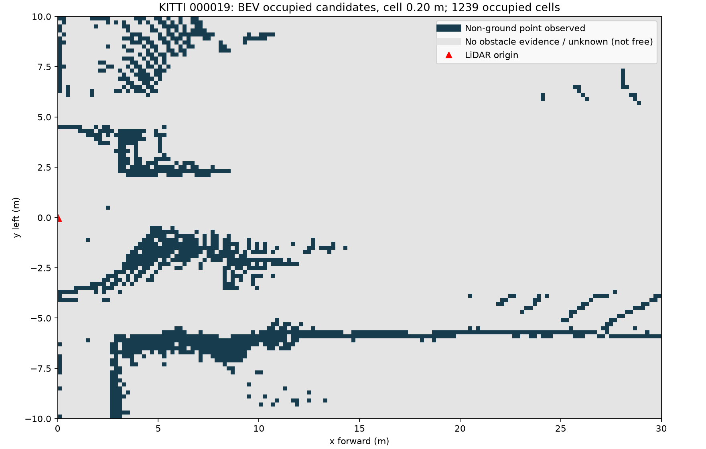

# CP4 — Failure DBSCAN và occupancy BEV

## Failure quan sát được


Frame KITTI000011, pedestrian GT index0: point membership trước xử lý 151 điểm trong ROI; voxel0,20 còn46, ground0,10 còn43. Ground plane và point cloud non-ground cố định; chỉ eps thay đổi, min_points10, seed42.

| eps (m) | Điểm non-ground trong GT | Core trong GT | Noise trong GT | Median / max hàng xóm |
|---:|---:|---:|---:|---:|
| 0,60 | 43 | 43 | 0 | 25 / 41 |
| 0,30 | 43 | 11 | 9 | 8 / 11 |
| 0,20 | 43 | 0 | 43 | 5 / 7 |

Tại eps0,60 cả43 điểm thuộc cùng cluster8; eps0,30 bị phân mảnh (dominant cluster25/43, noise9/43); eps0,20 không còn core nên43/43 thành noise và không có box cho điểm của pedestrian. Hàng xóm được đếm trong toàn bộ cloud non-ground, gồm chính điểm truy vấn, không chỉ trong GT. Chỉ nhìn tổng số điểm trên object (43≥10) là sai: DBSCAN yêu cầu mật độ cục bộ.

Lớp **Preprocess**: eps quá nhỏ so với khoảng cách mẫu, dù vật vẫn có nhiều điểm tổng. Lớp **Metric**: số cluster/nearest không chứng minh không bỏ sót người. Không kết luận lỗi calibration/time/model; đã test quy ước box và giữ cùng input, plane. GT box thuộc camera rectified bottom-center; h/w/l, yaw quanh y; point membership đổi LiDAR→camera rồi inverse rotation về local box. Corners cho BEV dùng inverse T_cam_velo.

Case bổ sung: pedestrian index1 bị che khuất có10 điểm non-ground, baseline eps0,60 đã8/10 noise. GT index3 có0 điểm ROI vì ngoài vùng xử lý, không tính là lỗi detector trong ROI. [failure_gt_membership.csv](../results/failure_gt_membership.csv) gồm cả những GT này để không che giấu. Không dùng point membership như AP/recall vì chưa matching box bằng IoU; GT box có thể có điểm nền/box overlap.

## Phát hiện và khắc phục

Log noise ratio/core-point fraction theo range, cluster extents, point count trước/sau ground, ground tilt. Giữ cảnh báo từ non-ground điểm noise, không coi không có cluster là free space. Dùng eps thích nghi range hoặc giảm min_points ở vùng thưa, nhưng phải kiểm tra false positive/cluster nhập và ground sót. Kiểm chứng trên log robot, vật thấp, nền không phẳng và pedestrian bị che khuất.

## Occupancy nâng cao



Frame000019, cell0,20 m, ROI30×20m:1239 ô có điểm non-ground. [occupancy_cells.csv](../results/occupancy_cells.csv) ghi tâm ô và số điểm. Dùng toàn bộ non-ground gồm cả noise. Ô trống là unknown/chưa có bằng chứng vật cản; chưa raycast nên không được gọi free. Bản đồ này chưa temporal fusion, inflation hay 3D; chưa đủ cho drone.

## Kiểm tra và chạy lại

```powershell
.\.venv\Scripts\python.exe -m src.failure
.\.venv\Scripts\python.exe -m unittest discover -s src -p "test_*.py"
```

13/13 test PASS, gồm bottom-center/yaw90°, inverse camera→LiDAR translation và biên occupancy. Ảnh đã kiểm tra, noise dùng đỏ riêng để không nhầm với màu cluster. Failure được xác nhận bằng assert khi tạo ảnh, không gán trước kết quả. CSV và [config](../results/failure_config.json) tái tạo từ code thật. Nguồn: KITTI Vision Benchmark Suite; quy ước theo starter/kitti_io.py; code/report có hỗ trợ Codex.
