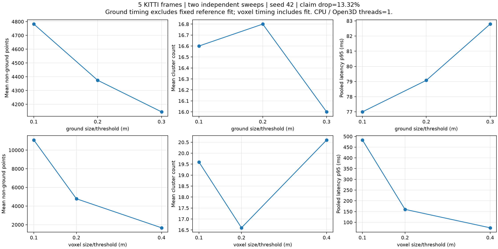
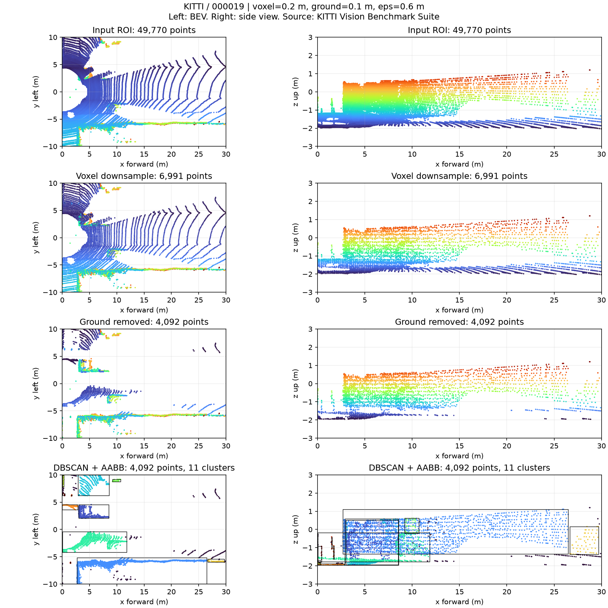
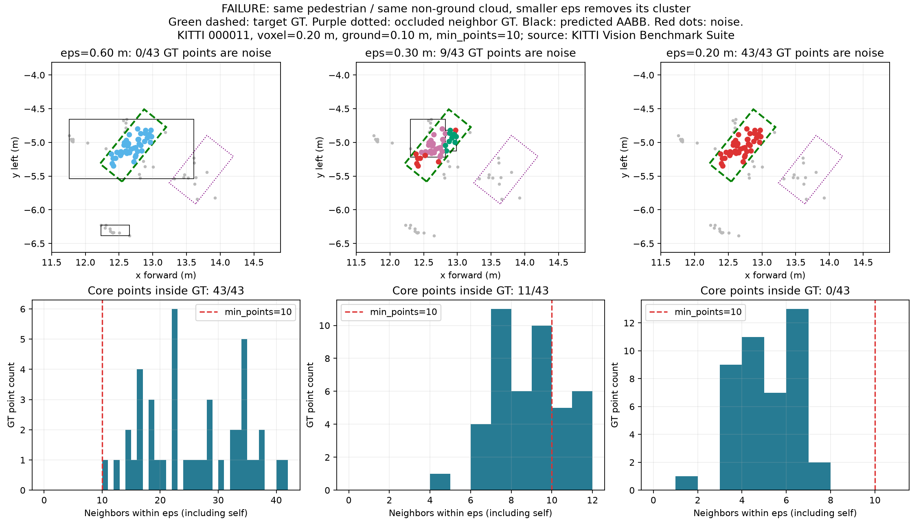

# Báo cáo Day 6: Phát hiện vật cản cho robot/drone

- **Họ tên:** Nguyễn Trọng Phúc
- **MSSV:** 2A202602552
- **Lớp:** Track 4 — VinUni AI20K
- **Link repo:** https://github.com/Wrxhard/NguyenTrongPhuc-2A202602552-Track4-Day21
- **Topic:** D — Robot/drone obstacle
- **Dataset:** `data/kitti_mini` (thí nghiệm chính); `data/synthetic` (kiểm tra dữ liệu/debug).
- **Các frame đã dùng:** synthetic `000000–000004` (CP0); KITTI `000001, 000011, 000019, 000025, 000049` (baseline/benchmark CP2–CP3; failure000011 và occupancy000019 ở CP4).

> **Minh chứng repo hoàn chỉnh:** CP0–CP5 đã kiểm tra; [CP6: kịch bản 3 phút và hỏi đáp](CP6.md) đã chuẩn bị. [Nhật ký CP5](CP5.md). Học viên còn cần tự tập nói, trình bày nếu được gọi và nộp link/hash trên LMS.

## 1. Claim

**Claim được ủng hộ trên 5 frame KITTI:** trong ROI x=[0,30], y=[−10,10], z=[−3,3] m, voxel 0,20 m và cùng mặt phẳng ground mỗi frame, tăng ground threshold từ 0,10 lên 0,30 m giảm **13,32%** trung bình số điểm non-ground (**4781,8 → 4145,0**), vượt giả thuyết CP1 ≥10%.

D = 100 × (mean N₀․₁ − mean N₀․₃) / mean N₀․₁. RANSAC fit ở 0,10 m, 1000 iterations, probability=1, seed 42, Open3D threads=1. Giảm điểm không đồng nghĩa tăng accuracy hoặc đã bỏ sót vật cản; chỉ kết luận trong mẫu/ROI này. Thiết kế ban đầu: [CP1](CP1.md).

## 2. Evidence

Hai sweep độc lập, 5 frame cố định. DBSCAN eps=0,60 m/min_points=10; ground sweep cố định voxel 0,20 m và plane, voxel sweep cố định ground 0,10 m.

| Sweep | Mức (m) | Mean non-ground | Mean cluster | Mean nearest (m) | p50 / p95 (ms) |
|---|---:|---:|---:|---:|---:|
| ground | 0.1 | 4781.8 | 16.6 | 1.740 | 48.41 / 77.00 |
| ground | 0.2 | 4374.2 | 16.8 | 2.454 | 49.19 / 79.08 |
| ground | 0.3 | 4145.0 | 16.0 | 2.751 | 45.37 / 82.79 |
| voxel | 0.1 | 11080.0 | 19.6 | 1.649 | 304.41 / 483.15 |
| voxel | 0.2 | 4781.8 | 16.6 | 1.740 | 99.50 / 160.20 |
| voxel | 0.4 | 1668.6 | 20.6 | 2.669 | 51.24 / 74.41 |





CSV [từng frame/config](../results/obstacle_sweep.csv), [tổng hợp](../results/obstacle_summary.csv), [kích thước từng cluster](../results/sweep_clusters.csv), [600 lượt latency](../results/latency_samples.csv). Warm-up bỏ 1 lượt, đo 20 lượt/frame/config; p50/p95 trong bảng pooled trên 100 lượt/config. CPU i5-10300H, Windows, Open3D 0.20/1 thread. Ground latency **không gồm fit plane tham chiếu**, voxel latency **có fit**; cả hai bỏ I/O/vẽ ảnh, không so tốc độ chéo hai sweep. Nearest là tới AABB dự đoán, không phải ground truth.

Nguồn: KITTI Vision Benchmark Suite. 30/30 hình học frame/config khớp chính xác khi chạy mới; latency dao động theo máy/tải. Chi tiết [CP3](CP3.md).

## 3. Failure case



KITTI `000011`, GT pedestrian index 0: cùng 43 điểm non-ground và min_points=10, giảm eps **0,60 →0,30 →0,20 m** cho **0/43 →9/43 →43/43 điểm noise**; core points tương ứng **43 →11 →0**. Ở eps0,20, mỗi điểm chỉ có tối đa **7** hàng xóm (gồm chính nó), dưới 10, nên mất toàn bộ cluster của pedestrian.

Lớp debug: **Preprocess** (tham số clustering không hợp mật độ) và **Metric** nếu chỉ nhìn tổng số cluster/nearest. GT được kiểm tra trong camera frame đúng bottom-center/yaw, point membership đổi LiDAR→camera rồi inverse rotation về local box (không dùng các hàm projection của topic khác). [CSV mật độ](../results/failure_density.csv), [GT membership](../results/failure_gt_membership.csv), giải thích [CP4](CP4.md). Theo dõi noise theo range/core fraction và raw non-ground occupancy; dùng eps/min_points thích nghi mật độ, kiểm tra nguy cơ nhập cluster khi tăng eps. Đây là một case, không phải benchmark AP/recall toàn dataset.

## 4. Khuyến nghị nếu triển khai thật

Robot mặt đất trong kho cần giữ được vật thấp và pedestrian thưa điểm: bắt đầu thử voxel0,20/ground0,10/eps0,60 rồi hiệu chỉnh trên dữ liệu kho có GT, vật thấp và nền dốc; cấu hình KITTI này chưa phải cấu hình tối ưu. Voxel0,40 nhanh hơn nhưng giảm điểm và dịch nearest; eps nhỏ có thể loại người thành noise. Ground threshold phải thấp hơn chiều cao vật cần tránh, có kiểm tra ground cục bộ thay một plane toàn cảnh.

Log số điểm hữu hạn/ROI/voxel/non-ground, ground tilt/inlier ratio, noise/core fraction theo range, số và kích thước cluster, nearest AABB, p95, timestamp và sensor health; cảnh báo no_cluster/ground invalid, không coi là đường trống. Đưa cả điểm noise vào occupancy để giữ cảnh báo sơ cấp, kết hợp footprint, braking distance và tracking.

[BEV occupancy](../results/figures/occupancy_000019.png): 1239 ô có điểm non-ground, cell0,20 m, vùng không có bằng chứng là **unknown**, chưa raycast free space. Drone cần occupancy 3D và kiểm tra vật phía trên, vì BEV2D làm mất chiều cao.

## 5. Cách chạy lại

Từ gốc repo, Windows PowerShell:

```powershell
python -m venv .venv
.\.venv\Scripts\python.exe -m pip install -r requirements-lock.txt
.\.venv\Scripts\python.exe tools/verify_data.py --data-root data/kitti_mini
.\.venv\Scripts\python.exe tools/verify_data.py --data-root data/nuscenes_mini_subset
.\.venv\Scripts\python.exe -m starter.data_health --data-root data/synthetic
.\.venv\Scripts\python.exe -m starter.data_health --data-root data/kitti_mini --out results/data_health_kitti.csv
.\.venv\Scripts\python.exe -m unittest discover -s src -p "test_*.py"
.\.venv\Scripts\python.exe -m src.experiments demo
.\.venv\Scripts\python.exe -m src.benchmark
.\.venv\Scripts\python.exe -m src.verify_geometry
.\.venv\Scripts\python.exe -m src.failure
.\.venv\Scripts\python.exe -m src.experiments demo --data-root data/synthetic --frames 000000 --out results/synthetic_debug
.\.venv\Scripts\python.exe tools/check_submission.py
```

`.\.venv\Scripts\python.exe -m src.experiments --help` giải thích tham số. Benchmark cần vài phút; latency có thể thay đổi, số liệu hình học cần khớp.

## 6. Khai báo sử dụng AI

| Công cụ | Dùng cho việc gì | Kiểm chứng đã thực hiện |
|---|---|---|
| ChatGPT / AI Assistant | Hỗ trợ tìm hiểu API Open3D, debug lỗi logic/syntax, gợi ý cách tối ưu vòng lặp và hỗ trợ format báo cáo Markdown. | Học viên trực tiếp thiết kế pipeline (ROI → voxel → RANSAC → DBSCAN), tự chọn cấu hình benchmark và trực tiếp chạy trên máy cá nhân để lấy số liệu thực tế. Đã viết 15 unit test để kiểm tra tính đúng đắn của logic (box transform, plane normalization, empty cloud). Số liệu được lưu minh bạch trong thư mục `results/`. |
| AI - Code Reviewer | Review lại các script đo đạc (benchmark, latency) để đảm bảo không bị rò rỉ dữ liệu (data leakage) và kiểm tra format xuất CSV. | Đối chiếu thủ công 30 metric rows, 600 lượt đo latency và kết quả cluster. So khớp cấu trúc với rubric để đảm bảo tính tái lập (reproducibility). |

Bài tập được thực hiện thông qua sự tự tìm hiểu và lập trình của học viên, với sự hỗ trợ của AI đóng vai trò như một trợ giảng (tutor) và pair-programmer. Toàn bộ các kết luận, phân tích số liệu và mổ xẻ failure case đều được học viên tự tổng hợp từ việc quan sát kết quả chạy kịch bản thực tế.
